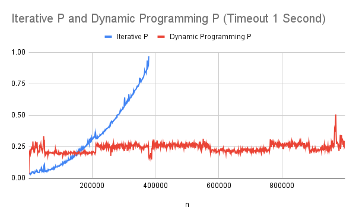
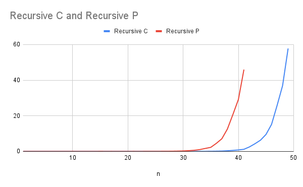
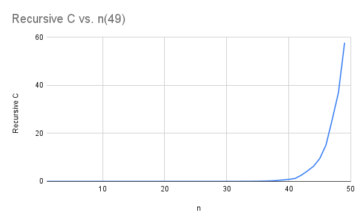
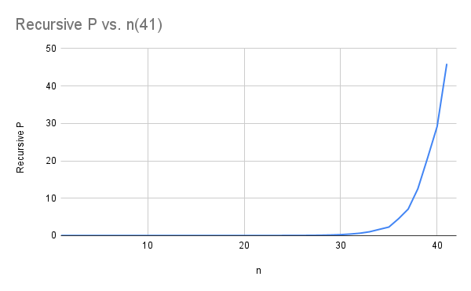
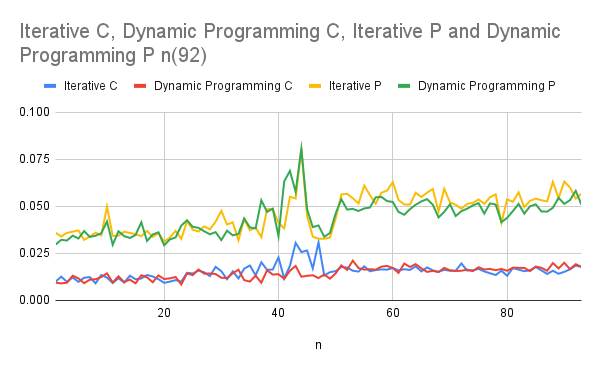

# Midterm p1: Report on Analysis of Fibonacci  Series
* **Author**: Brendan Sheehan
* **GitHub Repo**: https://github.com/Su23-CS5008-Online-Lionelle/midterm-bsheehan3117.git
* **Semester**: Summer 2023
* **Languages Used**: c, Python

## Overview
This report focuses on the speed differences between implementations of the Fibonacci Sequence. The Fibonacci sequence is a series of numbers where each number is the sum of the two numbers that come before it.  Those with an interest in nature may be surprised when they notice that the fibonacci sequence has a tendency to appear in countless places in the world around us; whether it be in patterns on leaves, animals, and fruits.  Those with an interest in math will find it's correlation to the golden ratio intriguing.  The Fibonacci Sequence can be represented with the following equation:


<font size="5">F</font><font size="3">(n)</font><font size="5"> = </font><font size="5">F</font><font size="3"> n-2</font><font size="5"> + </font><font size="5">F</font><font size="3"> n-1</font>

The Fibonacci sequence with an n value of 10 appears below as:

<font size="5">0, 1, 1, 2, 3, 5, 8, 13, 21, 34</font>

Three different functions were designed using two coding languages (Python and C) to implement the Fibonacci Sequence.  These are described in detail below.  Each language uses an iterative, recursive, and dynamic approach to solving the problem.

#### Iterative:
(Commented code in file c/py files, removed here to save space)
```text 
long long int fibonacci_iterative_c(int n, int print_level) {
    long long int a = 0, b = 1;  
    
    if (print_level > 1)
        printf("%lld ", a);
    
    for (int i = 0; i < n; i++) {
        long long int temp = a;
        a = b; 
        b = temp + b; 
        
        if (print_level > 1)
            printf("%lld ", a);
    }
    
    if (print_level == 1)
        printf("%lld\n", a);
    
    return a;
}
```
```text
def fibonacci_iterative_python(n, print_level):

    a, b = 0, 1  

    if print_level > 1:
        print(a, end=' ')

    for _ in range(n):
        a, b = b, a + b  
        if print_level > 1:
            print(a, end=' ')

    if print_level == 1:
        print(a)
    return a

```
The iterative functions both use a for loop to iterate over a range of numbers from 0 to n. The next number is calculated as the sum of the previous two numbers. This approach uses constant space and linear time, making it efficient for large values of n.

In terms of Big O notation and space complexity, we can express the BigO of the iterative function as O(n), since it iterates over n elements. The space complexity is O(1) as it keeps track of a constant number of values.

#### Recursive
```text
long long int fibonacci_recursive_c(int n, int print_level) {

    if (n <= 1) {
        if (print_level > 0)
            printf("%d\n", n);
        return n;
    }

    long long int result = fibonacci_recursive_c(n - 1, print_level) + fibonacci_recursive_c(n - 2, 0);
    
    if (print_level == 1 && n == print_level)
        printf("%lld\n", result);
    
    return result;
}
```

```text
def fibonacci_recursive_python(n, print_level):

    if n <= 1:
        if print_level > 0:
            print(n)
        return n

    result = fibonacci_recursive_python(n - 1, print_level) + fibonacci_recursive_python(n - 2, 0)
    if print_level == 1 and n == print_level:
        print(result)
    return result
```

The recursive functions first define base cases for recursion.  The base cases are when the value of n is less than or equal to 1 (The beginning of the Fibonacci Sequence).

When n is greater than 1, each function makes two recursive calls (n-1 and n-2) based on the above formula. The functions sum the results for the n value of the Fibonacci Seqeuence.

The time complexity of the recursive function is O(2^n) because each function call creates two recursive calls. The space complexity is O(n) because the function call stack needs to store information about n recursive calls.

#### Dynamic

```text
long long int fibonacci_dynamic_programming_c_helper(int n, long long int* dparray, int print_level) {

    if (dparray[n] != -1) {
        return dparray[n];
    }

    if (n <= 1) {
        dparray[n] = n;
        if (print_level == 2) {
            printf("%lld ", dparray[n]);
        }
        return n;
    }

    dparray[n] = fibonacci_dynamic_programming_c_helper(n - 1, dparray, print_level) + 
            fibonacci_dynamic_programming_c_helper(n - 2, dparray, print_level);

    if (print_level == 2) {
        printf("%lld ", dparray[n]);
    }
    
    return dparray[n];
}

long long int fibonacci_dynamic_programming_c(int n, int print_level) {

    long long int* dparray = (long long int*) malloc((n+1) * sizeof(long long int));

    for(int i = 0; i <= n; i++) {
        dparray[i] = -1;
    }

    long long int result = fibonacci_dynamic_programming_c_helper(n, dparray, print_level);

    free(dparray);

    return result;
}
```

```text
def fibonacci_dynamic_programming_python(n, print_level):

    darray = [-1 for _ in range(n + 1)]

    def dynamic_helper(n):

        if darray[n] != -1:
            return darray[n]

        if n <= 1:
            darray[n] = n
            if print_level == 2:
                print(n, end=' ')
            return n

        darray[n] = dynamic_helper(n - 1) + dynamic_helper(n - 2)

        if print_level == 2:
            print(darray[n], end=' ')
        return darray[n]

    return dynamic_helper(n)
```


In both dynamic approaches, an array is used to store the Fibonacci numbers. The index of the array represents the position in the Fibonacci series, and the value at that index is the Fibonacci number at that position.  Both approaches also use a helper function to check the array for already calculated values.  It then either returns the value if already calculated, or, recursively calls the previous two n values, sums them, and stores the new n value.

Both the BigO and space complexity of the dynamic approach are O(n). This is because we iterate over n elements one time, storing the result of each calculation in an array. The amount of time needed increases linearly with n, as well as the amount of memory used. 


The following chart represents the Big O value for each implementation described above.

| Version |  Big O | Space Used | 
| :-- | :-- |  :-- |
| Iterative | $O(n)$ | $O(1)$ |
| Recursive | $O(2^n)$  | $O(n)$ |
| Dynamic Programming | $O(n)$ | $O(n)$ |


## Empirical Data & Discussion 

For all empirical results, a couple different tests were ran to gather data due to limitations of the C language's ability to store data (more on that below) as well as for visibility of recursive results.

Tests were run without printing the value of n, though, the code in the files allows for printing either the value at a specific n, every value up to and including n, or not printing at all yet still returning the correct output.

Tests were run with a timeout of 60 seconds and the process time was recorded at every function call.
Tests were run with a timeout of 1 second with the process time being record every 1000 function calls.

These different test processes allowed for the clear results, as the different functions have memory or stack limitations.

Follow this link to the ([test script]).


#### Iterative and Dynamic C vs n


When run up to n(92) (C's limit for storage), there is a clear linear progression of time needed to run the program as the value of n increases.

#### Iterative and Dynamic Python vs n


Iterative and dynamic python functions run up to a very high n value of 1000000 with time being recorded every 1000 function calls with a time out of 1 second. The iterative function timed out early, while the dynamic function continued to run though the max n value.  The graph shows a clear linear progression of time of the iterative function as n increases.  The dynamic function appears to be increasing linearly, though, at a significantly lower rate than the iterative function. With such small increments of increasing time, the dynamic function's linear increase is displayed clearer in the bottom graph.

#### Recursive Python and Recursive C vs n


The recursive functions of C and Python both reach a timeout of 60 seconds.  They reach the timeout at different values of n, with the python function timing out at n(41) and the C function timing out at n(49).

#### Recursive C vs n


A chart displaying the recursive C function timing out at 60 seconds at n(49).

#### Recursive Python vs n


A chart displaying the recursive python function timing out at 60 seconds at n(41).

#### Iterative and Dynamic C and Python vs n


This chart displays test results of the iterative and dynamic C and python functions when run up to an n value of 92 (C's capacity for storage).  Notice the linear time progression of each function with increasing n values and the differences between speed to be discussed below.


Overall, there were a few interesting results:

The python iterative function timing out at 1 second while the dynamic function continued to run through the test.

The recursive python function timing out earlier than the recursive C function.

The storage limitation of C's long long data type being limited to an n value of 92.

Python's abiltiy to work with massive, seemingly limitless integer values.

The speed at which C is able to complete function calls in comparison to python as displayed in the bottom graph.

These results will be discussed in depth below.

## Language Analysis

The languages used in this report are C and Python.  Python was chosen as a second language due to some significant differences in comparison to C (it is a high level language with dynamic typing and automatic memory management) as well as due to past use experience.  This allowed us to compare and contrast the use of two very different tools and provide a better understanding of the advantages and disadvantages of a high level vs low level language.  In order to ensure that the results were consistent with one another, the implementation of each function was done as similarly as possible between both languages in order to compare key aspects of each language.  We actually created the python code first, and made an effort to create C code as similar as possible to the python code.

In particular, we wanted to test how the differences in memory management and typing impact speed and performance.  We learned of some interesting limitations of each language in the process.

The code writing can be found in the following files:

* [fibonacci_c.c]  -- implementation of functions in c
* [fibonacci_python.py] -- implementation of functions in python
* [test script] -- run script to help with tests and keep timings

### Language 1: C

C, a low-level language, provides access to memory allocation which allows for very fast code but also requires the user to free memory otherwise other problems may arise.

When implementing the Fibonacci sequence in C a significant challenge was managing memory allocation and release in the dynamic programming method to prevent memory leaks.

We used the long long type to store fibonacci numbers in the C language, which allowed us to gather enough data, but had a significant drawback.  The long long type is limited to a 64 bit integer.  This limited us to an n value of 92, as the 93rd n value of the fibonacci sequence requires more than 64 bits.  There are ways around the 64 bit limitation, however, they were not necessary as we were able to gather the necessary data.

Overall, C, being closer to binary than high level languages, allowed for lightning fast speeds at the expense of storage limitations and required memory management.

### Language 2: Python

Python is a high-level language with dynamic typing.  It is capable of handling large numbers without overflow and storing immense values in variables.

One key feature tested in Python was its automatic memory management. Unlike in C, we didn't have to worry about manually allocating and freeing memory in Python, which made the dynamic programming implementation more straightforward.

Python's automatic memory management allows for easier programming in comparison to other languages.  This allowed for simple code, particularly in the dynamic programming function.  Specifically, in the dynamic programming function, python's list allowed us to store results easily.

Overall, at the expense of speed, python enabled us to implement simpler code without worrying about memory management and allowed for massive values of n to be computed.


### Comparison and Discussion Between Experiences

Comparing the implementation of C vs Python in this project made a few things clear. Python, being a higher-level language, eliminates the need to do a number of things that C requires. This made Python simpler and faster to write than C.

On the other hand, the C implementations were faster than python's. This was made clear in the graph comparing the iterative and dynamic approaches of both languages.  There seems to be a clear trade off in this case; the high level language allowed for easier use, whereas the lower level language specifications allowed it to perform faster.

There was a significant difference in speed between the recursive implementation and the iterative and dynamic programming implementations. This was expected given the Big O notation differences discussed above. The recursive implementation took exponentially longer after the first few iterations, while the iterative and dynamic versions had a linear relationship between the n value and the time.

Building on the data we received from the recursive tests, it is noted that pythons recursive implementation timed out several n values sooner than C's.  While bot of these tests timed out, this still displays that C is capable of running faster than python.
It would be interesting to compare which value's of n would cause a stack overflow for each language's recursive implementation, though we stopped the calls at 60 seconds as we had gathered our data on speed.

As we increased the size of n to a very large input, Python's dynamic implementation was capable of running more efficiently than all other implementations. This was due to the memoization which allowed us to avoid repeating calculations as well as python's ability to store what seems to be infinitely large numbers.  C was incapable of handling these large inputs in our implementations, and was limited to the capacity of the long long storage of 64 bits.  Once n surpassed a value of 92, C could no longer store a larger value.

## Conclusions / Reflection

This project offered an interesting comparison between different algorithmic approaches to solving the Fibonacci sequence and how these implementations can differ between coding languages.

A major learning point from this project was the give and take that different languages offer. In other words, it was made clear that certain languages are capable of solving a problem more efficiently than others.  Choosing between a high level and low level language depends on what is most important for the project.  Python, a high level language, has an edge in being easier to read, use, and allows the computation of very large sets of data at the expense of speed.  The low level C language was clearly faster and more efficient at the expense of needing to manage memory manually and having a more complex syntax.

Another learning point was the observation of how different implementations to solve to the same problem can result in significantly different speed and efficiency. Recursive methods, while simple may not be the most efficient when large amounts of data need to be computed. Iterative and dynamic programming methods on the other hand, offer far better time complexities and allow us to compute larger amounts of data.

In conclusion, we learned that there is no one solution, language, or implementation that will work for every single problem. It is important to find the right tool for the job, with that tool being the right language or the right type of function.  This is entirely dependent on the specifics of whatever the project may be.  Is the project handling large data inputs?  Does it need to handle small amounts of data lightning fast?  Can we implement a solution with a BigO of linear or constant time?  All of these questions should be answered to create the most efficient program for the job.  


## References

1. Lionelle, A. (n.d.). Report on Analysis of Pascal’s Triangle [Review of Report on Analysis of Pascal’s Triangle].

<!-- auto references -->

[test script]: fibonacci_test_runner.py
[fibonacci_c.c]: fibonacci_c.c
[fibonacci_python.py]: fibonacci_python.py